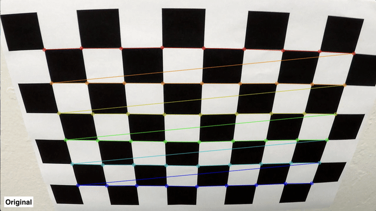
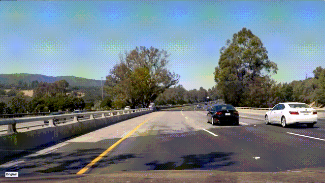
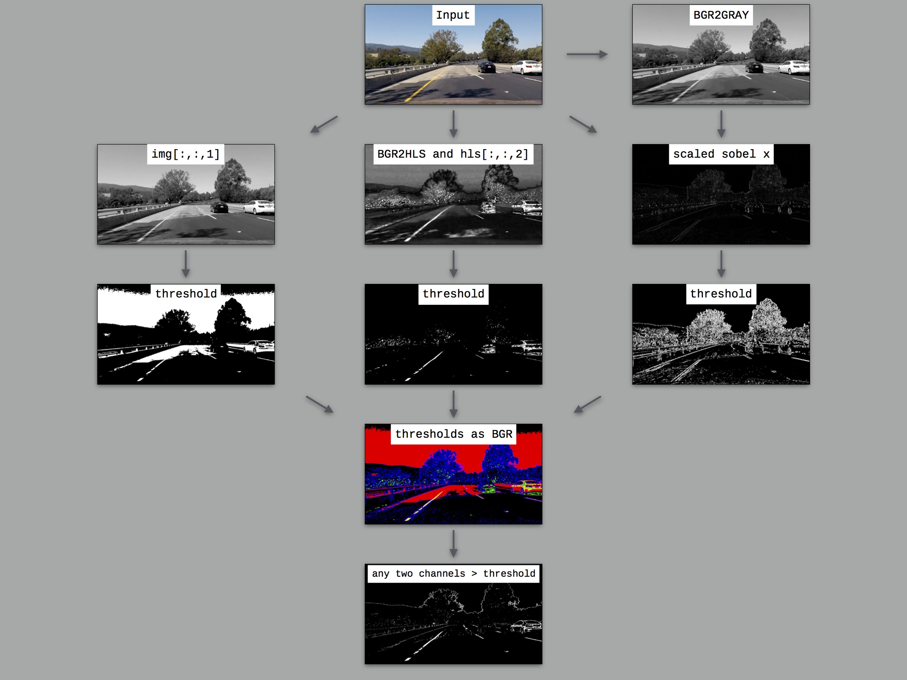

**Advanced Lane Finding Project**

The goals / steps of this project are the following:

* Compute the camera calibration matrix and distortion coefficients given a set of chessboard images.
* Apply a distortion correction to raw images.
* Use color transforms, gradients, etc., to create a thresholded binary image.
* Apply a perspective transform to rectify binary image ("birds-eye view").
* Detect lane pixels and fit to find the lane boundary.
* Determine the curvature of the lane and vehicle position with respect to center.
* Warp the detected lane boundaries back onto the original image.
* Output visual display of the lane boundaries and numerical estimation of lane curvature and vehicle position.

[//]: # (Image References)

[image1]: ./examples/undistort_output.png "Undistorted"
[image2]: ./test_images/test1.jpg "Road Transformed"
[image3]: ./examples/binary_combo_example.jpg "Binary Example"
[image4]: ./examples/warped_straight_lines.jpg "Warp Example"
[image5]: ./examples/color_fit_lines.jpg "Fit Visual"
[image6]: ./examples/example_output.jpg "Output"
[video1]: ./project_video.mp4 "Video"

## [Rubric](https://review.udacity.com/#!/rubrics/571/view) Points

### Here I will consider the rubric points individually and describe how I addressed each point in my implementation.  

---

### Writeup / README

#### 1. Provide a Writeup / README that includes all the rubric points and how you addressed each one.  You can submit your writeup as markdown or pdf.  [Here](https://github.com/udacity/CarND-Advanced-Lane-Lines/blob/master/writeup_template.md) is a template writeup for this project you can use as a guide and a starting point.  

You're reading it!

### Camera Calibration

#### 1. Briefly state how you computed the camera matrix and distortion coefficients. Provide an example of a distortion corrected calibration image.

The code for this step is contained in `calibrate_camera()` function (lines 25 through 50 of `pipeline.py`).  

I start by preparing "object points", which will be the (x, y, z) coordinates of the chessboard corners in the world. Here I am assuming the chessboard is fixed on the (x, y) plane at z=0, such that the object points are the same for each calibration image.  Thus, `objp` is just a replicated array of coordinates, and `objpoints` will be appended with a copy of it every time I successfully detect all chessboard corners in a test image.  `imgpoints` will be appended with the (x, y) pixel position of each of the corners in the image plane with each successful chessboard detection.  

I then used the output `objpoints` and `imgpoints` to compute the camera calibration and distortion coefficients using the `cv2.calibrateCamera()` function.  I applied this distortion correction to the test image using the `cv2.undistort()` function and obtained this result: 



### Pipeline (single images)

#### 1. Provide an example of a distortion-corrected image.

To demonstrate this step, I will describe how I apply the distortion correction to one of the test images like this one:


#### 2. Describe how (and identify where in your code) you used color transforms, gradients or other methods to create a thresholded binary image.  Provide an example of a binary image result.

I used a combination of color and gradient thresholds to generate a binary image (thresholding steps at lines 59 through 94 in `pipeline.py`).  Here's an example of output at each stage of the pipeline for one of the test images.



#### 3. Describe how (and identify where in your code) you performed a perspective transform and provide an example of a transformed image.

The code for my perspective transform includes a function called `perspective_warp()`, which appears in lines 96 through 109 in the file `pipeline.py`.  The `perspective_warp()` function takes as inputs an image (`img`).  I chose to hardcode the source and destination points in the following manner:

```python
    src = np.float32([
        [  586,   446 ],
        [  713,   446 ],
        [ 1119,   683 ],
        [  254 ,  683 ]])
    dst = np.float32([
        [offset, 0], 
        [img_size[0] - offset, 0], 
        [img_size[0] - offset, img_size[1]], 
        [offset, img_size[1]]])
```

This resulted in the following source (black) and destination points (red):


I verified that my perspective transform was working as expected by drawing the `src` and `dst` points onto a test image and its warped counterpart to verify that the lines appear parallel in the warped image.


#### 4. Describe how (and identify where in your code) you identified lane-line pixels and fit their positions with a polynomial?

I take histogram of bottom half of the image and identify peaks for left lane and right lane. The code for this step is contained in `refit_histogram()` function (lines 139 through 237 of `pipeline.py`). Then I fit idenfied left and right lane points with a 2nd order polynomial like this.


From the second frame onwards, I re-use the coefficients previously calculated to narrow down my search of the lane points and then polynomial fit on these points. During this process if the lane lines are not parallel then I discard the current coefficients and continue to next frame, code for this is contained in lines 261 through 277 of `pipeline.py`.

During histogram calculation and polyfit of lane lines if I find that lane width is not between 600 to 700 pixels, then I discard the numbers and continue using previous values. Code for this is contained in lines 214 through 218 of `pipeline.py`.

#### 5. Describe how (and identify where in your code) you calculated the radius of curvature of the lane and the position of the vehicle with respect to center.

Radius of the curvature is calculated on line 235 of `pipeline.py`. Position of the vehicle with respect to center is calculated on line 315 of `pipeline.py`.

#### 6. Provide an example image of your result plotted back down onto the road such that the lane area is identified clearly.

I implemented this step in lines 292 through 321 in my code in `pipeline.py` in the function `plot_lanes()`.  Here is an example of my result on a test image:


---

### Pipeline (video)

#### 1. Provide a link to your final video output.  Your pipeline should perform reasonably well on the entire project video (wobbly lines are ok but no catastrophic failures that would cause the car to drive off the road!).

Here's a [link to my video result](./output_images/project_video.mp4).

[](https://www.youtube.com/watch?v=SZ690B3u7pg)
---

### Discussion

#### 1. Briefly discuss any problems / issues you faced in your implementation of this project.  Where will your pipeline likely fail?  What could you do to make it more robust?

I am taking a mean of polyfit coefficients for last 5 frames to stabilize the detections, code for this is contained in lines 281 through 289 of `pipeline.py`. Even though this approach is working for the project video, it may become a problem if there are sharp turns. One approach might be to do higher degree polynomial fit.

Another problem is that the thresholds are hard-coded, lines 13 through 15 and line 86 of `pipeline.py`. These threshold should be dynamically adjusted based on changes in road type.
